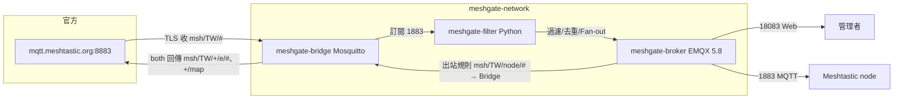
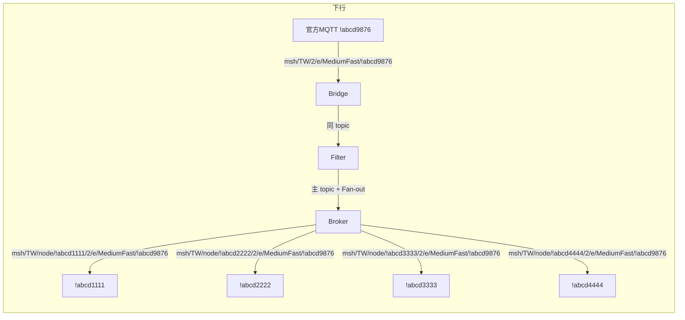
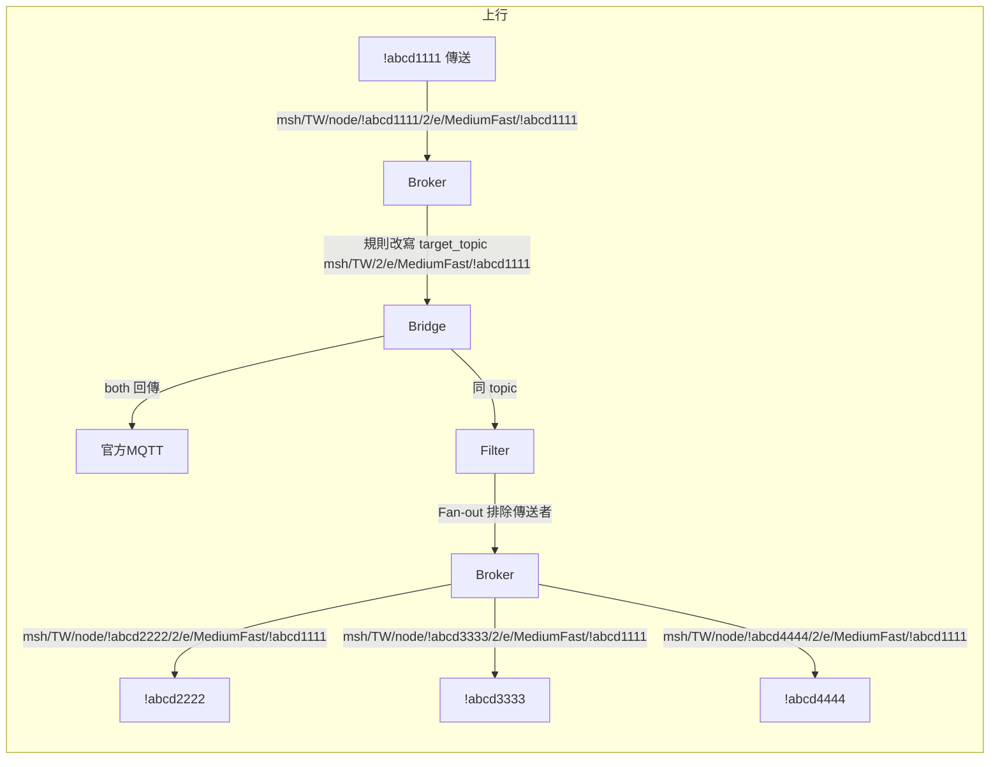
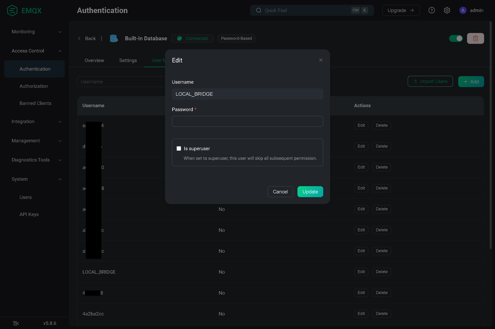
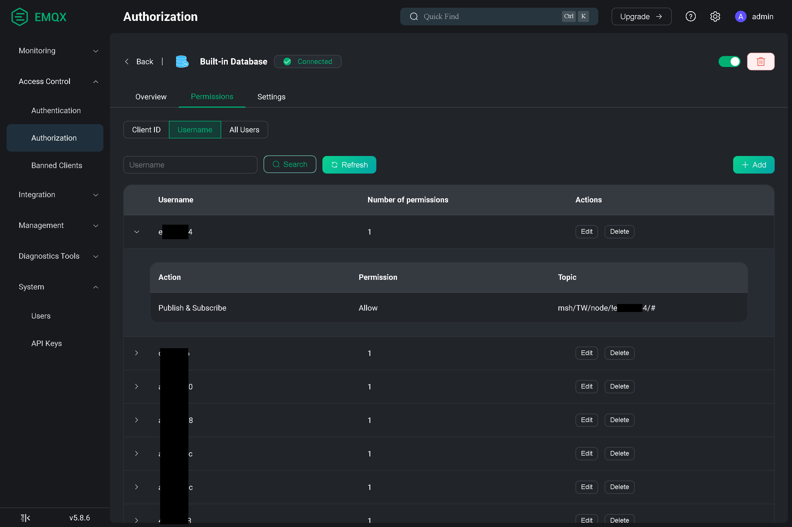
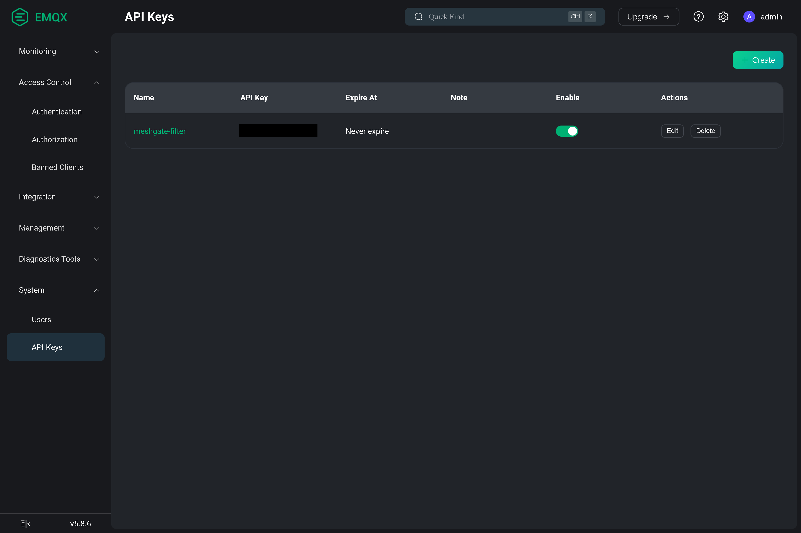

# MeshGate（Meshtastic MQTT 閘道器）

以 Docker Compose 執行的 Meshtastic MQTT 橋接與過濾閘道器：從官方伺服器訂閱臺灣區（`msh/TW`）訊息，經本地過濾與去重後轉發至本地 EMQX Broker。內網有兩類客戶端：**管理者**透過 18083 Web 介面操作，**Meshtastic 節點**透過 1883 MQTT 連線。

> **⚠️ 警告**  
> 本專案會橋接官方 Meshtastic MQTT 並在本地轉發，若設定不當（例如 topic、過濾規則、出站規則誤配）可能造成**封包風暴**或影響官方與本地網路。建議由**具備本專案與 MQTT／EMQX 知識**的人員進行建置與維運。

---

## 如何避免封包風暴

透過以下機制降低重複轉發與迴圈，避免封包風暴：

| 機制 | 位置 | 說明 |
|------|------|------|
| **去重** | meshgate-filter | 以 `(from_id, packet_id)` 記錄已轉發封包，TTL 內（預設約 30 秒）同一封包不重複轉發至 Broker |
| **過濾** | meshgate-filter | `config.yaml` 的 **ignoreId** 排除指定節點；**path 字首**僅轉發 `/2/e/` 等；**rx_time** 過期（預設 300 秒）不轉發；程式內 **EXCLUDE_NODE_ID_CONTAINS** 可排除特定 node id 片段 |
| **Fan-out 排除傳送者** | meshgate-filter | Fan-out 至各節點時跳過**傳送者**，不把同一封包再傳回原節點，避免本地迴圈 |
| **防迴圈** | meshgate-broker 出站規則 | 出站規則排除 `username = LOCAL_BRIDGE`，Filter 寫入的訊息**不會**被轉回 Bridge，切斷 Broker → Bridge → Filter → Broker 迴圈 |
| **出站規則過濾** | meshgate-broker | 僅轉發 topic 符合 8 位 node 結尾或 `/map`、非空 payload，並可排除如 `/!abcd` 等，減少無效或測試封包回傳官方 |

正確設定上述設定項（尤其是 Broker 出站規則與 Filter 的 ignoreId／path）可避免設定誤配導致的封包風暴。

---

## 架構概覽



| 服務 | 映像／技術 | 說明 |
|------|------------|------|
| **meshgate-bridge** | eclipse-mosquitto:2 | 橋接官方 `mqtt.meshtastic.org:8883` → 內網 1883，訂閱/轉發 `msh/TW/#`、`msh/TW/+/e/#`、`msh/TW/+/map` |
| **meshgate-broker** | emqx/emqx:5.8 | 本地 MQTT Broker（埠 1883）、Dashboard（18083），停用匿名、ACL；內建**出站規則**將 `msh/TW/node/#` 轉發至 Bridge 再回傳官方 |
| **meshgate-filter** | Python 3.12 + aiomqtt | 訂閱 bridge，依 `config.yaml` 過濾（ignoreId、path、去重），轉發至 broker，支援 Fan-out 到 `msh/TW/node/!{node_id}{path}` |

---

## 前置需求

- Docker、Docker Compose
- 對外可連線至 `mqtt.meshtastic.org:8883`
- 已建立 **meshgate-network** Docker 網路（`docker network create`）

---

## 快速開始

### 1. 環境變數

複製範例並編輯：

```bash
cp .env.example .env
```

必填欄位：

| 變數 | 說明 |
|------|------|
| `MESHGATE_BROKER_PASSWORD` | EMQX Dashboard 預設密碼（登入 18083） |
| `MESHGATE_BROKER_API_KEY` | EMQX Management → API Keys 建立的 Key（meshgate-filter Fan-out 用） |
| `MESHGATE_BROKER_API_SECRET` | 上述 API Key 的 Secret |

### 2. 建立外部網路（若尚未建立）

```bash
docker network create meshgate-network
```

### 3. 啟動

```bash
docker compose up -d
```

### 4. 檢查

- **Bridge**：訂閱 `meshgate-bridge:1883` 的 `msh/TW/#`
- **Broker**：
  - **管理者**：瀏覽器連 `http://localhost:18083`（帳號 `admin`，密碼同 `MESHGATE_BROKER_PASSWORD`）
  - **Meshtastic node**：MQTT 連線 `localhost:1883`（節點端 MQTT 設定見下方）
- **Filter**：依 `meshgate-filter/config.yaml` 過濾並轉發至 broker

**首次部署**：第一次 `docker compose up -d` 後，請先登入 `http://localhost:18083` 建立使用者 **LOCAL_BRIDGE**（認證）與 **API Key**（Management → API Keys），並將 API Key/Secret 填入 `.env`。必要時執行 `docker compose restart meshgate-filter`，Filter 才能正常連線 Broker 並完成 Fan-out。

---

## Meshtastic 節點端 MQTT 設定

若 Meshtastic 裝置或 App 要連到本專案的 Broker（埠 1883），請在節點端 MQTT 設定中調整為：

| 設定項 | 設定值 |
|------|--------|
| **MQTT 伺服器** | 執行 MeshGate 的主機位址（例如 `192.168.1.10` 或 `localhost`） |
| **埠** | `1883` |
| **Root topic** | **`msh/TW/node/!{node_id}`**（`{node_id}` 為該節點的 8 位元 node id，例如 `!9ea1f700`） |
| **帳號／密碼** | 在 EMQX Dashboard 建立 MQTT 使用者後填入（Broker 已停用匿名） |

8 位元 node id 可從 **Meshtastic App** 的節點資訊或裝置設定中查詢。

Root topic 設為 `msh/TW/node/!{node_id}` 後，節點釋出的 topic 才會被 Broker 出站規則 `msh/TW/node/#` 匹配並轉發至 Bridge 回傳官方；Filter 的 Fan-out 也會把訊息轉發到 `msh/TW/node/!{node_id}{path}`，節點才能收到。

---

## compose.yml 說明

目前版本僅使用單一外部網路 **meshgate-network**，三項服務皆連於此網；broker 不再掛載 traefik。

| 設定項 | 內容 |
|------|------|
| **meshgate-bridge** | 無對外 port，僅內網 1883；記憶體上限 256M；healthcheck 訂閱 `$$SYS/broker/version` |
| **meshgate-broker** | 對外 **1883**（MQTT）、**18083**（Dashboard）；依 `.env` 設密碼與匿名關閉；掛載 acl.conf、cluster.hocon |
| **meshgate-filter** | 建置自 `./meshgate-filter`；啟動前 sleep 10 秒；依 broker/bridge healthy 後才啟動 |
| **networks** | `meshgate-network: external: true`，需事先建立 |

---

## 目錄與設定檔

| 路徑 | 說明 |
|------|------|
| `compose.yml` | 服務定義、埠位、Volume、健康檢查（見下方 compose 說明） |
| `meshgate-bridge/mosquitto.conf` | 橋接目標、topic、TLS、帳密 |
| `meshgate-broker/acl.conf` | EMQX 授權規則（例如 LOCAL_BRIDGE 可 publish `msh/TW/#`） |
| `meshgate-broker/cluster.hocon` | EMQX 進階設定（認證、授權、**規則引擎**、MQTT 聯結器至 Bridge 等） |
| `meshgate-filter/config.yaml` | 訂閱來源、本地 broker、過濾規則（ignoreId 等） |
| `meshgate-filter/main.py` | 過濾邏輯、去重、Fan-out、EMQX API 呼叫 |
| `storage/meshgate-bridge/log` | Mosquitto 日誌 |
| `storage/meshgate-broker/data`、`storage/meshgate-broker/log` | EMQX 資料與日誌 |

---

## Broker 出站規則（cluster.hocon）

EMQX 規則引擎內有一條**出站規則** `rule_broker_to_bridge`，會把本地客戶端發到 Broker 的特定訊息轉發到 meshgate-bridge，再由 Bridge 的 both 規則回傳官方，實現「內網發文 → 官方」路徑。

| 設定項 | 說明 |
|------|------|
| **觸發 Topic** | `msh/TW/node/#` |
| **動作** | 經聯結器 `meshgate_bridge_connector` 轉發至 `meshgate-bridge:1883` |
| **Topic 轉換** | 發往 Bridge 時改為 `msh/TW/...`（去掉 `msh/TW/node/!{id}/` 字首） |
| **防迴圈** | 排除 `username = LOCAL_BRIDGE`，避免 Filter 寫入的訊息再被轉回 Bridge |
| **過濾條件** | 僅轉發 topic 符合 8 位 node 結尾（`/![a-zA-Z0-9]{8}$`）或 `/map`、非空 payload、排除 `!abcd` 等 |

規則與聯結器定義在 `meshgate-broker/cluster.hocon`；若在 Dashboard 修改規則，需將變更同步回此檔以持久化。

---

## 封包與 topic 轉換範例

**本範例角色**：連上 **meshgate-broker**（本地）的客戶端為 **!abcd1111**、**!abcd2222**、**!abcd3333**、**!abcd4444**；連上**官方 MQTT** 的客戶端為 **!abcd9876**。封包 topic 為 `msh/TW/2/e/MediumFast/!abcd9876`。

### 下行：官方封包 `msh/TW/2/e/MediumFast/!abcd9876` → 本地四臺節點



| 階段 | 位置 | Topic | 說明 |
|------|------|-------|------|
| 1 | 官方伺服器 | `msh/TW/2/e/MediumFast/!abcd9876` | 官方客戶端 !abcd9876 相關之臺灣區封包 |
| 2 | meshgate-bridge | `msh/TW/2/e/MediumFast/!abcd9876` | Bridge 訂閱 `msh/TW/#`，原樣收到 |
| 3 | meshgate-filter | 訂閱收到 `msh/TW/2/e/MediumFast/!abcd9876` | 解包、去重、過濾後轉發至 Broker |
| 4 | meshgate-broker | `msh/TW/2/e/MediumFast/!abcd9876` | Filter 傳送至主 topic |
| 4' | meshgate-broker | `msh/TW/node/!abcd1111/2/e/MediumFast/!abcd9876` 等 | Fan-out 再傳送至各節點專用 topic（!abcd1111～!abcd4444 各一份） |
| 5 | 節點 !abcd1111～!abcd4444 | 各訂閱 `msh/TW/node/!abcdxxxx/#`，收到對應 `msh/TW/node/!abcdxxxx/2/e/MediumFast/!abcd9876` | 四臺皆為連線 meshgate-broker 的客戶端，Root topic 為 `msh/TW/node/!abcdxxxx` |

### 上行：本地節點傳出封包 → 官方（例：!abcd1111 傳出）



| 階段 | 位置 | Topic | 說明 |
|------|------|-------|------|
| 1 | 節點 !abcd1111 | 傳送 `msh/TW/node/!abcd1111/2/e/MediumFast/!abcd1111` | 連 meshgate-broker 的客戶端傳送，topic 末碼為**傳送者 node_id**（!abcd1111） |
| 2 | meshgate-broker | 收到 `msh/TW/node/!abcd1111/2/e/MediumFast/!abcd1111` | 出站規則匹配 `msh/TW/node/#` |
| 3 | 規則引擎 | `target_topic` = `msh/TW/2/e/MediumFast/!abcd1111` | 去掉字首 `msh/TW/node/!abcd1111/`，末碼為傳送者 !abcd1111 |
| 4 | meshgate-bridge | 收到 `msh/TW/2/e/MediumFast/!abcd1111` | 聯結器轉發至 Bridge |
| 5 | 官方伺服器 | `msh/TW/2/e/MediumFast/!abcd1111`（both） | Bridge 回傳官方，官方上 topic 末碼為傳送者 !abcd1111，其他客戶端可訂閱收到 |
| 6 | 其他本地節點 !abcd2222、!abcd3333、!abcd4444 | 各收到 `msh/TW/node/!abcdxxxx/2/e/MediumFast/!abcd1111` | 同一封包經規則送到 Bridge 後，Filter 訂閱 Bridge 的 `msh/TW/#` 會**直接收到**，再經 Fan-out 轉發。因 **去重**（同一封包 from_id+packet_id 不重複轉發）與 **Fan-out 時排除傳送者**，不會再傳回原本傳送的節點 !abcd1111 |

---

## 過濾閘道器（meshgate-filter）設定

- **來源**：預設訂閱 `meshgate-bridge:1883` 的 `msh/TW/#`
- **目標**：連線 `meshgate-broker`，以帳號 `LOCAL_BRIDGE` 傳送。**需在 EMQX 認證（Authentication）中新增使用者**：帳號 `LOCAL_BRIDGE`，密碼與 `meshgate-filter/config.yaml` 的 `local.password` 相同（預設為 `LOCAL_BRIDGE`）；否則 Filter 無法透過認證、連不上 Broker。授權由 `meshgate-broker/acl.conf` 控制：LOCAL_BRIDGE **僅可傳送**（publish）至 `msh/TW/#`，不可訂閱（只可上發），符合閘道器只需寫入、不需訂閱本地訊息的設計。
- **過濾**：`config.yaml` 內 `filter.ignoreId` 為節點 ID（解包後 `from`），符合者不轉發；另可限制 path 字首、去重 TTL 等（見 `main.py` 常數）
- **Fan-out**：需在 EMQX 建立 API Key 並填入 `.env` 的 `MESHGATE_BROKER_API_KEY`、`MESHGATE_BROKER_API_SECRET`，轉發至 `msh/TW{path}` 與 `msh/TW/node/!{node_id}{path}`

修改 `config.yaml` 後重啟 filter 即可：

```bash
docker compose restart meshgate-filter
```

---

## 埠位一覽

| 服務 | 埠 | 說明 |
|------|----|------|
| meshgate-bridge | （僅內網） | 僅在 meshgate-network 內 1883，不對外暴露 |
| meshgate-broker | 1883 | MQTT（Meshtastic node 等客戶端連線） |
| meshgate-broker | 18083 | EMQX Dashboard（管理者 Web 介面） |

---

## 授權與安全

- **meshgate-broker**：`EMQX_AUTH__ALLOW_ANONYMOUS=false`，所有 MQTT 連線需帳密；Dashboard 密碼由 `MESHGATE_BROKER_PASSWORD` 設定。
- **ACL**：`meshgate-broker/acl.conf` 限制誰可訂閱/傳送哪些 topic；`LOCAL_BRIDGE` 僅允許 **publish**（只可上發）`msh/TW/#`、不允許 subscribe，一般使用者不得訂閱 `$SYS/#` 等系統 topic。

---

## EMQX Dashboard 設定範例

以下為 EMQX 18083 後臺常見設定的畫面參考，便於對照本專案所需之認證、授權與 API Key。

**認證（Authentication）** — 密碼認證、內建資料庫。請在此新增使用者 `LOCAL_BRIDGE`、密碼與 `config.yaml` 的 `local.password` 一致，供 meshgate-filter 連線 Broker 使用：



**授權（Authorization）** — 內建資料庫與 ACL 檔案：



**API Key** — Management → API Keys，供 meshgate-filter Fan-out 呼叫 EMQX API：



---

## 常見問題

- **Filter 無法連到 broker**：確認 broker 已 healthy、`.env` 中 API Key/Secret 正確、EMQX 已建立對應 API Key，且認證中已建立使用者 `LOCAL_BRIDGE`（密碼與 `config.yaml` 的 `local.password` 一致）。
- **收不到臺灣區封包**：確認 bridge 可連線 `mqtt.meshtastic.org:8883`（如防火牆、TLS），且 `mosquitto.conf` 中 `topic msh/TW/# in 0` 已啟用。
- **節點收不到或傳不出去**：依序檢查 (1) **Root topic** 是否為 `msh/TW/node/!{node_id}`（8 位 node id）；(2) 是否已在 EMQX 認證中建立該節點用的 **MQTT 使用者**，且授權允許訂閱/傳送對應 topic；(3) Broker **出站規則**是否啟用（`msh/TW/node/#` → Bridge）；(4) 上行時 topic **末碼**是否為**傳送者 node_id**（例如 !abcd1111 傳送則為 `.../!abcd1111`）。
- **想排除特定節點**：在 `meshgate-filter/config.yaml` 的 `filter.ignoreId` 加入該節點 ID（數字字串）。

---

## 參與貢獻

如果您有功能請求或發現錯誤，請在 GitHub 上[開啟 issue](https://github.com/NFS-TW-Developer/MeshGate/issues)。

## 法律宣告

This project is not affiliated with or endorsed by the Meshtastic project.

The Meshtastic logo is the trademark of Meshtastic LLC.

## 倉儲狀態

